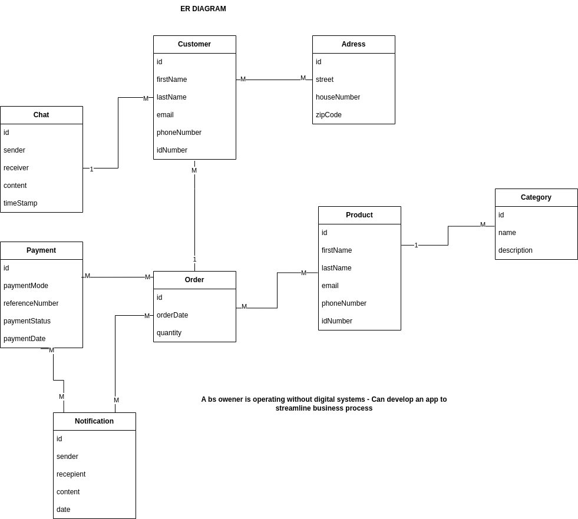
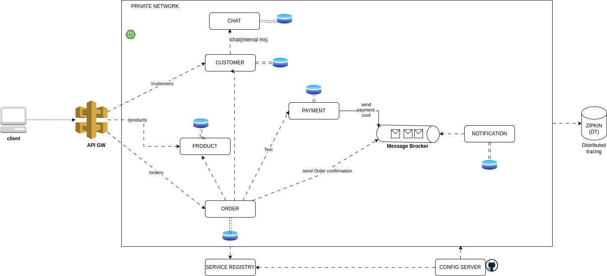
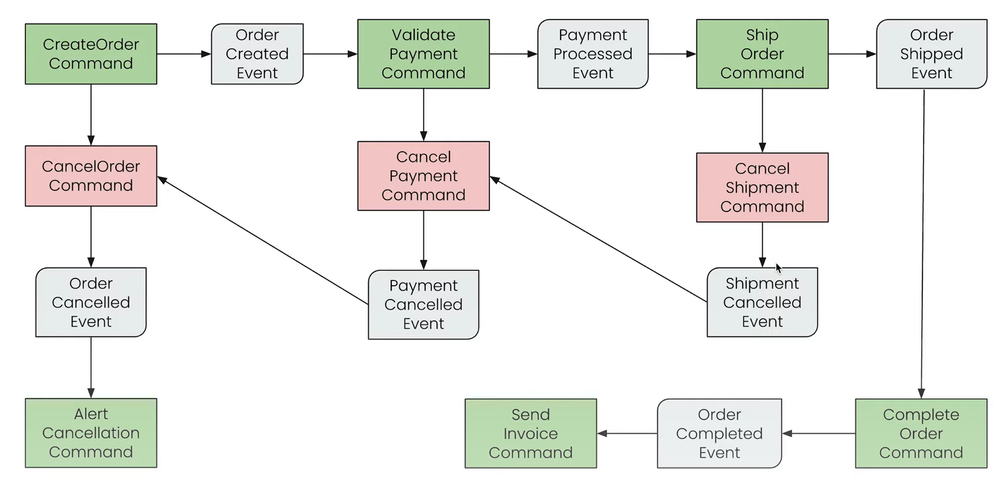
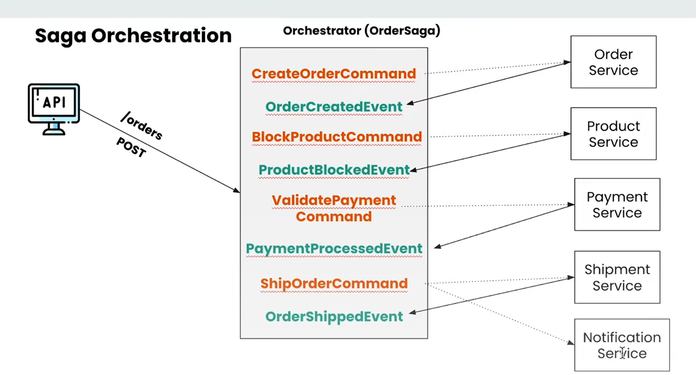

# MicroServices (MonoRepo)

## Design

## Architecture

## Overview

## Advantages of Microservices Architecture

1. **Enhanced Scalability**
    - **Horizontal Scaling**: Easily scale out by adding more instances of a service to handle increased load. This approach ensures that the system can handle high traffic volumes and maintain availability.
    - **Vertical Scaling**: Improve the performance of a service by adding more resources (such as CPU, memory) to existing instances. This method is beneficial for optimizing resource-intensive services.

2. **Independent Deployment**
    - Microservices can be developed, tested, and deployed independently. This independence allows teams to deploy new features or updates without affecting other services, enabling continuous integration and continuous delivery (CI/CD).

3. **Improved Fault Tolerance**
    - **Isolation**: Each service operates independently, so a failure in one service is less likely to impact the overall system. This isolation helps prevent cascading failures.
    - **Circuit Breakers**: Implementing circuit breakers helps to prevent failures from spreading by providing fallback mechanisms and preventing repeated attempts to access a failing service.
    - **Health Checks**: Regular health checks ensure that services are functioning properly and can automatically remove or restart unhealthy instances, maintaining system stability.

4. **Technological Flexibility**
    - Microservices architecture allows the use of different technologies, programming languages, and frameworks for each service. This flexibility enables teams to choose the best tool for each specific task and incorporate new technologies without a complete system overhaul.

5. **Faster Development of Features**
    - The independent nature of microservices allows teams to work on different services simultaneously, speeding up the development process. This structure supports agile methodologies and rapid iteration, enabling faster delivery of new features and improvements.

The system is designed to provide scalable, secure, and resilient services by leveraging microservices architecture. Key design patterns include:

- **API Gateway**: The single entry point for incoming requests, handling routing, security, traffic control (load balancing, rate limiting, caching), and observability (monitoring and logging).
- **Discovery Server (Eureka)**: Service registry for dynamic discovery of microservices.
- **Event Driven - Message Broker**: Handles communication in a distributed environment (e.g., Kafka).
- **Saga pattern**: Managing distributed transactions across the MS
- **Circuit Breaker Pattern**: Impl fault-tolerant mechanism for MS, preventing cascading failures
- **Retry Pattern**: Enhances microservices' resilience by automatically retrying failed operations

 ************************************************************************************************
- **Zipkin**: Distributed tracing for monitoring and troubleshooting.
- **Config Server**: Centralized configuration management for all microservices.
- **Business Services**: Core services including ProductService, OrderService, and PaymentService.

## Patterns

### API Gateway

The API Gateway acts as a traffic cop, managing all incoming requests and routing them to the appropriate microservices. Key functionalities include:

- **Routing**: Directing API calls to the correct microservice.
- **Security**: Implementing authentication and authorization - Check on keycloak.
- **Traffic Control**: Load balancing, rate limiting, and caching.
- **Observability**: Monitoring and logging for operational insights.

### CQRS Pattern
- Command Query Responsibility Segregation
- Article on CQRS
-  (Check On[ event sourcing](https://www.axoniq.io/concepts/cqrs-and-event-sourcing) and CQRS)
   -[ Axon Framework](https://docs.axoniq.io/axon-framework-reference/development/)
- Efficient for constructing efficient and scalable services
- Prescribes a strict split within an application, isolating the command and query components.
- Event Sourcing stores all changes to the application state as a sequence of events.
- This allows you to query events, reconstruct past states, and adjust state for retroactive changes.

### Saga Pattern
- Manage data consistency / Transaction management
- Atomicity - All statements in a transaction are treated as a single unit either complete or not at all
- Event-Driven Architectures (EDA) are software systems where services communicate by producing and responding to events
- An event is a record of something that has happened within the system, such as, for example, a user creating a new account on a website, an order being placed, or a payment being processed
- EDA is the creation of loosely coupled services. Since services communicate through events rather than direct calls
- Asynchronous communication is another key benefit. Services in an EDA system do not wait for immediate responses when they emit events
  
  

### Message Broker
A message broker, such as Kafka, is used for validating, storing, routing, and delivering messages to appropriate destinations. It facilitates communication in a distributed environment.

#### Circuit Breaker

To enhance fault tolerance, we use a circuit breaker pattern that prevents cascading failures by providing fallback mechanisms when services are down or experiencing issues.

- **Goal**: Handle failures gracefully and maintain system stability.
- **Dependencies**:
    1. **Gateway**: For routing, security, monitoring, metrics, and resiliency.
    2. **Eureka Client**: Reads data from the Discovery Client.
    3. **Config Client**: Fetches configuration from the Config Server.
    4. **Actuator**: Provides application metrics and operational information.

For more details, refer to the following resources:
- [Martin Fowler on Circuit Breaker](https://martinfowler.com/bliki/CircuitBreaker.html)
- [Resilience4j Documentation](https://resilience4j.readme.io/docs/circuitbreaker)
- [Medium Article on Circuit Breaker in Microservices](https://nirajtechi.medium.com/circuit-breaker-in-microservices-and-spring-boot-example-4ad76c7a33e6)

### Discovery Server (Eureka)

The Eureka Discovery Server acts as a service registry where each microservice registers itself. This enables the API Gateway and other services to discover available services dynamically.

- **Dependencies**:
    - Eureka Server
    - Config Client
    - Spring Actuator for metrics

### Config Server

The Config Server centralizes configuration management for all microservices, ensuring consistency and ease of management.

- **Dependencies**:
    - Config Server
    - Config Client
    - Spring Actuator for metrics
    - 
### Business Services

Our core business services include:

1. **ProductService**
2. **OrderService**
3. **PaymentService (Paypal)**

These services handle the business logic and are accessible through the API Gateway.

### Zipkin

Zipkin is used for distributed tracing, providing visibility into the flow of requests across microservices. It helps in monitoring and troubleshooting issues.

- **Setup**: `docker run -d -p 9411:9411 openzipkin/zipkin`

This microservices architecture ensures a scalable, secure, and resilient system, capable of handling high traffic and maintaining operational integrity in the face of failures.
 