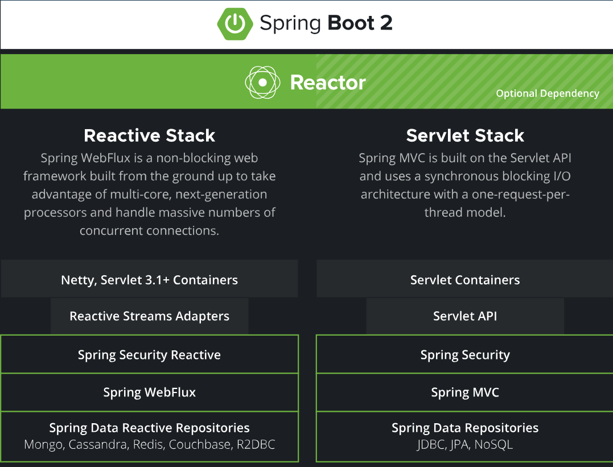

### [Reactive](https://spring.io/reactive) Programming
- The goal is to create responsive, resilient and scalable application
- Responsive means reactive quickly to the user without delay
- The goal is to handle high loads of traffic
- Backpressure is a mechanism that allows the consumer of data to control the rate at which the producer produces data
#### Servlet API
- The Servlet API is a Java specification that defines how web servers (like Tomcat, Jetty, or WildFly) handle requests and responses in Java web applications. It provides a way to create Java Servlets, which are Java classes used to process HTTP requests and generate responses.
#### Key Features of the Servlet API

- Handles HTTP Requests & Responses – Processes GET, POST, PUT, DELETE, etc.
- Session Management – Manages user sessions with cookies and HTTP sessions.
- Filters & Listeners – Allows intercepting and modifying requests and responses.
- Servlet Lifecycle – Defines how servlets are initialized, executed, and destroyed.

#### Servlet API vs Spring Boot
Servlets are the foundation of Java web applications.
Spring Boot builds on top of the Servlet API but provides Spring MVC for a more structured, easier-to-use approach.

##### Spring WebFlux (reactive programming) is an alternative to Servlets, removing the need for blocking threads.
 

Accessing and processing data in a reactive way is important. MongoDB, Redis, and Cassandra all have native reactive support in Spring Data. Many relational databases (Postgres, Microsoft SQL Server, MySQL, H2, and Google Spanner) have reactive support via [R2DBC](https://github.com/r2dbc
). In the world of messaging, [Spring Cloud Stream](https://spring.io/projects/spring-cloud-stream) also supports reactive access to platforms like RabbitMQ and Kafka.

Spring Cloud Stream is a framework for building highly scalable event-driven microservices connected with shared messaging systems.